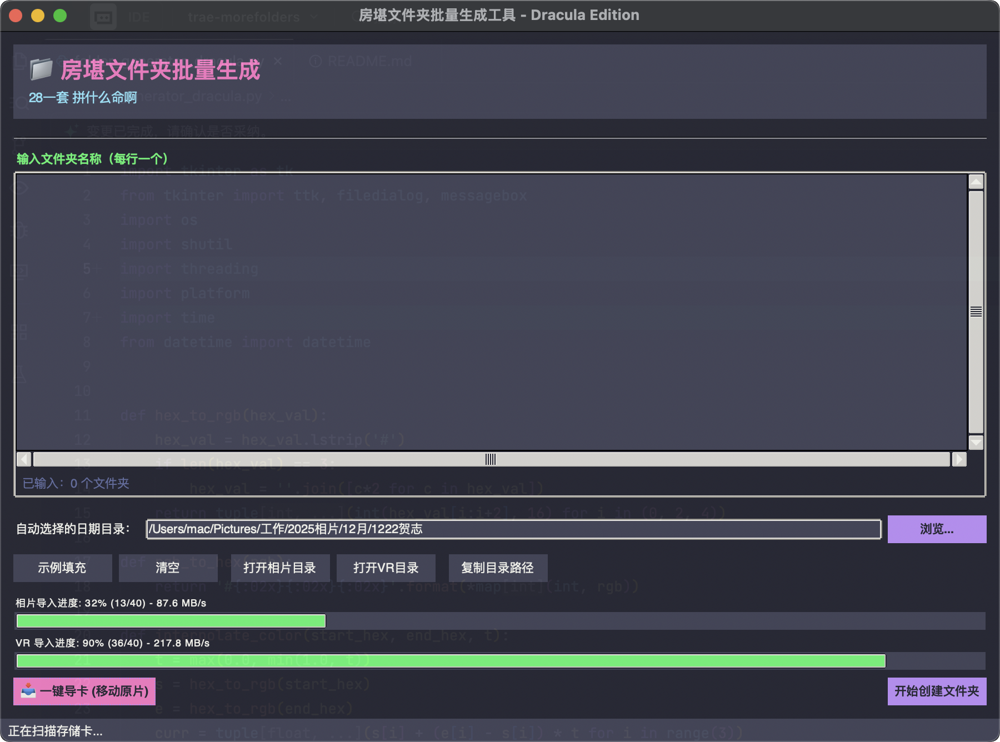

# 📁 房堪工作流自动化助手 · V2（Dracula 版）  
**House Survey Workflow Assistant/Create folders in batches**

[English Version](README_EN.md)

> **“28 一套，拼什么命啊。”**  
> 但文件夹要是乱了，真的会少赚这 28。

这是一个**为房产摄影 / 房堪工作流量身定制的桌面自动化工具**。  
它解决的不是“不会建文件夹”，而是——  
**每天都在重复建文件夹、还要建对、建快、建得心情好。**

V2 版本在保持 **Python 原生、零依赖、开箱即用** 的前提下，对 **UI 体验、交互细节、并发性能** 进行了彻底重构。  
一句话总结：**不只是能用，而是顺手、耐看、还能给点情绪价值。**


---

## ✨ 项目简介

房堪拍摄的真实日常通常是这样的：

- 今天几套？  
- 相片、VR 两路目录要不要对齐？  
- 日期对没对？  
- 文件名里有没有“/”？  
- 导卡的时候界面卡死了？  
- 拍完一堆，心里只剩一句：“我这是在干嘛？”

本工具正是为了解决这些“看起来不复杂、但每天都在消耗你精力的小事”。

它是一个**跨平台桌面 GUI 应用**，专注于三件事：

1. **文件夹一次建对**
2. **素材一次导完**
3. **收入算得清清楚楚**

而 V2 版本，让这三件事变得**更快、更稳、更好看**。

---

## 🚀 核心功能总览

### 📂 1. 批量文件夹生成 批量创建文件夹（房堪刚需）

- **一次输入，双路同步**
  - 同时在「相片」与「VR」目录中创建对应房源文件夹
- **日期自动识别**
  - 年 / 月 / 日自动匹配，无需手敲
- **标准化目录结构**
  - 相片目录：  
    `.../{YYYY}相片/{MM}月/{MMDD}贺志`
  - VR 目录：  
    `.../{YYYY}VR/{MM}月/{MMDD}`
- **非法字符自动清洗**
  - `/ \ : * ? " < > |` 自动替换，macOS / Windows 通吃
- **智能文本清洗（New）**
  - 实时去除门店名称前后缀（如 `XHJ`、`A店A业务组`）
  - 只保留关键门店名，输入框实时预览
- **高频操作一键完成**
  - 打开目录 / 复制路径 / 示例填充，全都不需要多想

---

### � 2. Excel 自动继承（New）

- **自动回溯**
  - 创建文件夹时，自动查找最近一天（365天内）存在的 Excel 文件
- **智能复制**
  - 将昨日的 `xxxx贺志.xlsx` 自动复制到今日文件夹
  - 并自动重命名为今日日期，无需手动另存为

---

### �💰 3. 收入实时计算（精神支撑系统）

- 按 **¥28 / 套** 自动计算今日预计收入
- 输入即统计，创建即更新
- 完成后弹窗提示：  
  > “今天不亏，至少是紫的。”

---

### ⚡️ 3. 极速智能导卡（V2 重点升级）

V2 引入了真正**可感知的性能提升**：

#### 🚄 多线程并发导入
- 后台多线程处理文件 IO
- **导卡过程中界面不冻结**
- 相片 / VR **双路并行传输**

#### 📊 极客级进度可视化
- 实时传输速度显示（如 `86.4 MB/s`）
- 双进度条独立显示：
  - 百分比
  - 文件数（`23 / 51`）
- 你能清楚知道：
  - 在干活
  - 干得快
  - 没在摸鱼

#### 🛡 安全机制
- 存储卡未插入 → 自动跳过
- 源目录为空 → 不报错、不吓人
- 所有路径均做存在性校验

---

## 🎨 V2 UI / UX 深度升级（重点）

> **本项目 V2 的 UI 升级，全部基于 Python 标准库完成。**  
> 没有引入任何第三方 UI 框架。

### 🧛 Dracula 暗色主题
- 全界面采用 **Dracula 官方配色**
- 护眼、克制、不廉价
- 非“随便调暗”，而是成体系的色彩规范

---

### 🧠 仿 VS Code 编辑器体验
- 自定义输入组件实现：
  - **行号显示**
  - **当前行高亮**
  - **文本与行号同步滚动**
- 用来填房源名，却有写代码的仪式感

---

### 🌊 原生流体动画
- 按钮 Hover 时采用颜色插值算法
- 平滑渐变，无跳变、无闪烁
- **完全不依赖第三方动画库**

---

### 💜「紫气东来」情绪状态栏
- 状态栏颜色会根据输入的房堪套数变化
- 从冷静深灰 → 富贵淡紫
- 套数越多，越“紫”
- 一个非常不必要、但非常好用的设计

---

### 🖥 跨平台自适应
- 自动识别 Windows / macOS / Linux
- macOS Retina 高分屏适配
- Windows DPI 缩放支持
- 字体自动切换：
  - Windows：微软雅黑
  - macOS：Helvetica

---

## 🛠 技术栈

- **语言**：Python 3.x  
- **GUI**：Tkinter / ttk（标准库）
- **并发**：threading + UI 安全回调
- **文件系统**：os / shutil
- **依赖**：**零依赖（Zero Dependency）**

> 不需要 `pip install`  
> 不需要虚拟环境  
> 不需要解释“为什么打不开”

---

## 🚀 快速开始

### 环境要求
- Python 3.x
- macOS / Windows / Linux
- 推荐 macOS（默认路径更贴合房堪习惯）

### 运行方式
```bash
python3 folder_generator_dracula.py

```

---


## 📌 适合谁？

如果你符合下面任意一条，这个工具大概率能让你每天少骂两句电脑：

- **房产摄影师 / 房堪摄影从业者**  
  每天重复建目录、拷素材、对日期，对到开始怀疑人生。

- **VR / 全景拍摄人员**  
  相片、VR 双线并行，最怕目录一乱，后期直接加班。

- **高频拍摄、多套连拍的工作模式**  
  一天十几套，手动建文件夹不是不会，是不值得。

- **讨厌“能用但难用”的工具的人**  
  不追求花里胡哨，但至少要顺手、稳定、不反人类。

- **对 UI 有基本审美要求的工具控**  
  暗色主题、细节动画、状态反馈，一个都不想将就。

---

**28 一套，确实不贵。**  
但如果工具顺手一点，  
每天少烦一点，  
那这 28，至少赚得不那么憋屈。

*Created with ❤️ by JhihHe*


