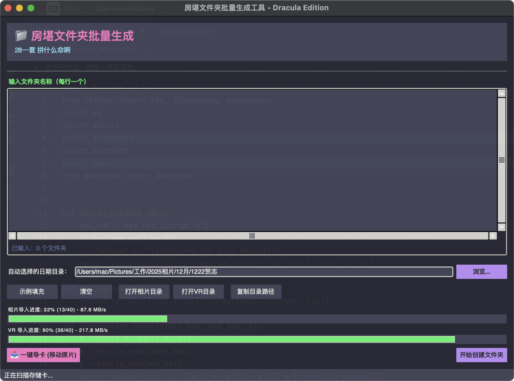

# 📁 房堪工作流自动化助手（Dracula 版）  
**House Survey Workflow Assistant / Create folders in batches**

[English Version](README_EN.md)

[](https://www.python.org/)
[](https://docs.python.org/3/library/tkinter.html)
[](https://draculatheme.com/)
[](https://openpyxl.readthedocs.io/)
[](#)
[](#)
[](https://github.com/jhihhe/Folderbatchgenerationtool)
[](https://github.com/jhihhe/Folderbatchgenerationtool/issues)
[](https://github.com/jhihhe/Folderbatchgenerationtool/stargazers)

> **“28 一套，拼什么命啊。”**  
> 但文件夹要是乱了，真的会少赚这 28。

这是一个为房产摄影 / 房堪工作流打造的桌面工具：**批量建目录 + 自动继承/写入 Excel + 双路并发导卡 + 收入实时统计**。  
它解决的不是“不会建文件夹”，而是：**每天都在重复做、还要做对、做快、最好还别把心态做崩。**



---

## 🔥 V2.1 重大更新
- **Excel 写入提速**：不再全量扫描历史数据，改为只处理“最近一个非今日日期”的数据块，创建流程明显更快。
- **表格视觉标准化**：旧数据整行标绿，但会自动跳过 **K/L/M/N** 四列（保留原始格式）。
- **摄影师姓名自定义**：目录名、Excel 文件名、表格“摄影师”列都随你的名字变化。
- **姓名自动记忆**：首次默认空；修改一次后自动保存，下次启动自动恢复。

---

## ✨ 你会得到什么
### 1) 批量创建文件夹（相片 + VR 双路同步）
- **一次输入，双路创建**：同一份房源列表，同时生成相片与 VR 两路目录。
- **日期自动拼路径**：按年/月/日自动落盘，无需手动改文件夹层级。
- **非法字符自动替换**：`/ \\ : * ? \" < > |` 自动处理，macOS/Windows 都不炸。
- **输入智能清洗**：实时移除门店名里的常见前后缀（例如 `XHJ`、`A店A业务组`），更适合“复制粘贴就走人”的节奏。

**默认目录结构（示例）**
```text
{root}/2026相片/03月/0313{摄影师姓名}/0313{摄影师姓名}.xlsx
{root}/2026VR/03月/0313/
```

### 2) Excel 智能引擎（继承 + 追加 + 标色）
- **自动回溯模板**：如果今日 Excel 不存在，会在历史（默认 365 天内）寻找最近一天的 Excel 并复制到今日目录。
- **无条件追加写入**：输入多少行，就写入多少行；不做重复检测，避免“漏写”的心理阴影。
- **智能序号识别**：输入里自带 `1.` / `1、` 这类序号会被识别并写入。
- **当月套数自动递增**：从上一行读取并递增，减少手动填表。

**表格样式规则（更容易一眼分清“今天做了啥”）**
- **今日新数据**：只把 HS 列标黄（醒目但不刺眼）。
- **最近一天旧数据**：整行标绿，表示“已经是历史完成项”。
- **K/L/M/N 列跳过**：这四列保留原有样式，不破坏你原本的表格布局与格式。

### 3) 双路并发导卡（不卡 UI）
- **相片 / VR 双任务并行**：两路同时跑，整体更快。
- **极客进度信息**：进度条 + 文件数 + 速度（例如 `86.4 MB/s`），你能清楚看到“它在干活、干得快”。
- **安全策略**：
  - 未插卡/目录不存在：不报一堆异常，直接给出可读提示。
  - 源目录为空：显示状态但不中断流程。
  - 目标目录写入测试：提前发现权限/只读盘问题。

### 4) 紫气东来：情绪状态栏（完全没必要，但真的好用）
输入套数越多，底部状态栏会从冷静深灰逐步变成富贵紫：  
- **0–5 套**：从灰到紫快速过渡（“今天开始动了”）  
- **5–10 套**：稳定紫（“状态上来了”）  
- **10–30 套**：紫到粉渐变（“紫得离谱但确实在赚钱”）  

它不改变你的工作效率，但能明显改变你对“输入套数”这件事的心理反馈。

### 5) UI/UX 细节升级（Dracula + 类 VS Code 输入体验）
- **Dracula 暗色主题**：整体配色克制，长时间盯着不累。
- **类编辑器输入框**：行号、当前行高亮、文本/行号同步滚动，复制粘贴大段内容更舒服。
- **按钮 Hover 平滑渐变**：颜色插值过渡，避免“突然变色”的廉价感。

---

## 🚀 快速开始
### 环境要求
- Python 3.10+（推荐 3.12 / 3.13）
- macOS / Windows / Linux

### 安装依赖（Excel 功能需要）
```bash
pip install openpyxl
```

### 运行
```bash
python3 main.py
```

---

## 🧾 输入格式示例
每行一个房源，序号可有可无：
```text
1. A店 张三 望京SOHO 1号楼 1101 东向 两室
2、B店 李四 XX小区 3号楼 902 南北通透 三室
```

---

## ⚙️ 配置与文件位置
- 摄影师姓名保存：`~/.fangkan_helper_config.json`
- 默认路径配置：`src/utils/config.py`

---

## 📦 打包（生成 macOS .app / Windows .exe）
```bash
pip install pyinstaller
python3 -m PyInstaller --noconfirm --clean "房堪助手.spec"
```

---

## 🖼 更多截图


---

## FAQ
### Excel 保存失败（提示文件被占用）
请先关闭正在打开的 Excel 文件，再点击创建。

### 摄影师姓名为空会怎样？
- 相片目录：`.../{MMDD}`（不带姓名后缀）
- Excel 文件：`MMDD.xlsx`
