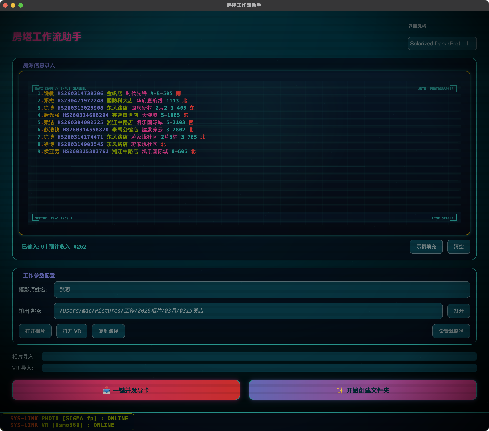

# 房勘工作流助手 · House Survey Workflow Assistant

<div align="center">


<h3>An Automated Workflow Solution for Real Estate Photography & VR Teams</h3>
<h3>面向房产摄影与全景 VR 团队的自动化工作流解决方案</h3>

<p>
    <a href="README.md">中文</a> | <a href="#english">English</a>
</p>

<!-- Badges -->
<p>
    
    
    
    
</p>

<p>
    
    
    
    
    
</p>

<p>
    
    
</p>

</div>

---

## 📸 界面预览 / Interface Preview

<div align="center">
    
    <p><em>Electron 版本：3D 粒子背景与全息 HUD 界面</em></p>
</div>

---

## 📖 项目简介 (Introduction)

**房勘工作流助手** 是一个专为房产摄影和全景采集团队打造的高效生产力工具。它将繁琐的日常工作（录入房源信息、创建标准化目录、从相机/全景相机导出素材、写入 Excel 报表）串联成一条全自动化的流水线。

项目目前维护两个版本：
1.  **Electron 重构版 (Main)**：采用现代 Web 技术栈 (React + TS + Tailwind)，拥有电影级的赛博朋克/星战 UI，支持 3D 背景、全息动效和并发高性能 I/O。
2.  **Python 原生版 (Legacy/Stable)**：基于 PyQt6，拥有极致复古的“雷达终端”风格，体积小巧，逻辑纯粹，适合喜欢硬核科技感的用户。

---

## ✨ 核心功能 (Key Features)

### 🚀 自动化工作流
*   **批量目录生成**：只需粘贴一段房源文本，即可自动解析并生成“相片+VR”的双层标准化目录结构。
*   **智能 Excel 写入**：自动寻找前一日的工作报表作为模板，追加当日数据，并完美继承单元格样式与行高。
*   **并发素材导出**：支持同时从单反相机 (SD卡) 和全景相机 (VR卡) 导出素材，实时显示传输速度与进度。

### 🛡️ 硬件与系统交互
*   **全盘设备扫描**：不再局限于固定盘符，自动扫描 macOS/Windows 所有挂载卷，智能识别相机卡（如 `100SIGMA`, `Osmo360` 等）。
*   **智能名称识别**：优先显示卷标名称；若卷标未命名，自动深度读取照片 EXIF 信息获取相机型号（如 `[SIGMA fp]`, `[Insta360 X3]`）。
*   **跨平台支持**：完美适配 macOS (dmg/app) 与 Windows (exe)，针对 macOS 提供自动签名修复脚本。

### 🎨 极致 UI/UX 设计
*   **Electron 版**：
    *   Three.js 驱动的 3D 粒子星空背景。
    *   全息玻璃拟态 (Glassmorphism) 状态栏与卡片。
    *   流畅的 Framer Motion 交互动画。
*   **Python 版**：
    *   **CRT 沉浸式遮罩**：全局扫描线、动态刷新波纹、屏幕噪点与暗角。
    *   **星战 HUD 风格**：精细的战术终端布局，完全矢量绘制的装饰线与角标。
    *   **多主题切换**：内置“赛博朋克”、“德古拉”、“极致雷达(黑绿)”等多种硬核配色。

---

## 🛠️ 安装与使用 (Installation)

### Electron 版本 (推荐)

**环境要求**: Node.js 20+, npm 10+

```bash
# 进入目录
cd electron-app

# 安装依赖
npm install

# 启动开发服务器
npm run dev

# 打包应用 (macOS)
npm run build -- --mac

# 打包应用 (Windows)
npm run build -- --win
```

构建产物将位于 `electron-app/dist/` 目录。

### Python 版本

**环境要求**: Python 3.10+

```bash
# 安装依赖
pip install -r requirements.txt

# 启动应用
python main.py

# 打包应用 (需安装 PyInstaller)
pyinstaller build.spec --clean --noconfirm
```

构建产物将位于 `dist/` 目录。

---

<div id="english"></div>

## 🌏 English Introduction

**House Survey Workflow Assistant** is a productivity tool designed for real estate photography and VR teams. It streamlines the tedious daily workflow—entering listing info, creating standardized directories, exporting footage from cameras, and writing Excel reports—into a fully automated pipeline.

This repository maintains two versions:
1.  **Electron Refactored Version (Main)**: Built with modern Web tech (React + TS + Tailwind), featuring cinematic Cyberpunk/Star Wars UI, 3D backgrounds, holographic effects, and high-performance concurrent I/O.
2.  **Python Native Version (Legacy/Stable)**: Based on PyQt6, featuring an "Extreme Radar Terminal" retro style, compact size, and pure logic for hardcore tech enthusiasts.

### Key Features

*   **Batch Directory Generation**: Generate standardized "Photo + VR" directory trees from a single text paste.
*   **Smart Excel Writing**: Automatically finds the previous day's report as a template, appends new data, and inherits cell styles perfectly.
*   **Concurrent Export**: Simultaneously export footage from DSLR (SD Card) and VR Cameras with real-time speed monitoring.
*   **Smart Device Detection**: Scans all mounted volumes on macOS/Windows. Identifies cameras by Volume Name first, then by deep EXIF scanning (e.g., `[SIGMA fp]`, `[Osmo360]`).
*   **Immersive UI**: 
    *   **Electron**: 3D Particle background, Holographic glassmorphism.
    *   **Python**: CRT scanlines, screen noise, glitch effects, and tactical HUD layouts.

---

## 📂 目录结构 (Directory Structure)

```text
.
├── electron-app/            # Electron + React + TS Main Application
│   ├── src/                 # React UI Source
│   ├── electron/            # Electron Main Process
│   └── ...
├── src/                     # Python Application Core
│   ├── ui/                  # PyQt6 UI & Styles (HUD, CRT Effects)
│   ├── services/            # Business Logic
│   └── utils/               # Helpers
├── assets/                  # Shared Assets (Icons, Images)
├── build.spec               # PyInstaller Configuration
├── main.py                  # Python Entry Point
└── README.md                # Documentation
```

---

## 🤝 贡献 (Contributing)

欢迎提交 Issue 或 Pull Request 来改进这个项目！
Welcome issues and pull requests to improve this project!

## 📄 许可证 (License)

[MIT License](LICENSE) © 2024 JhihHe
